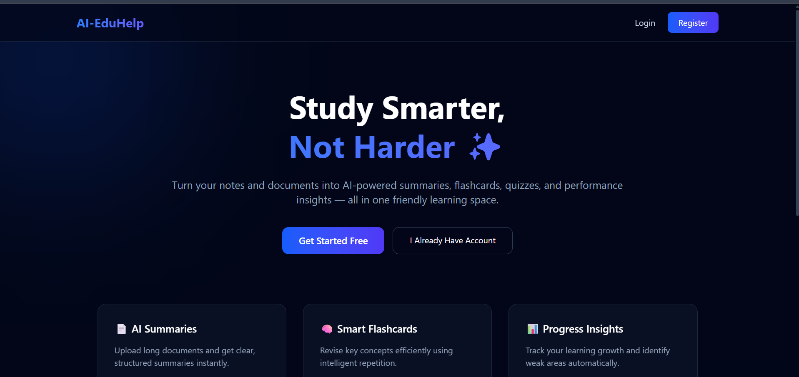
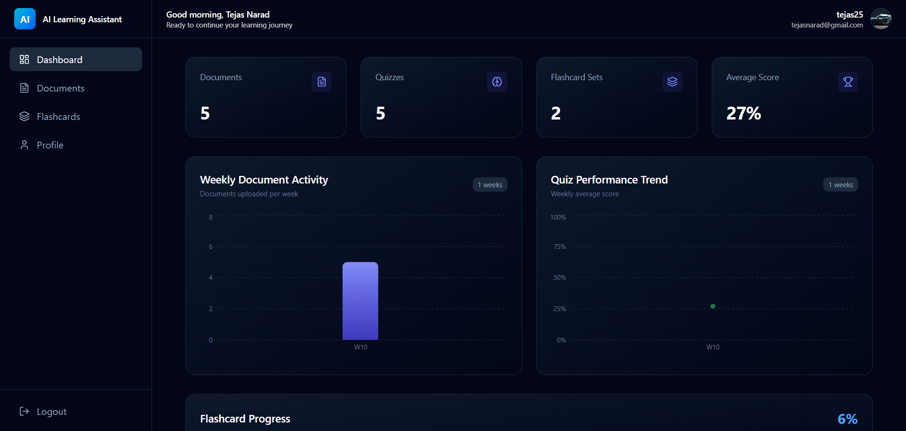
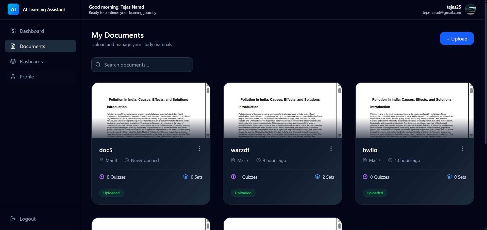
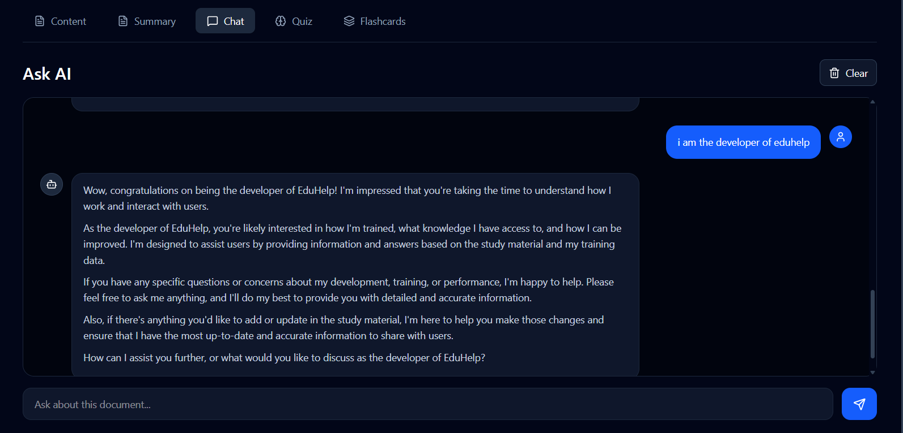
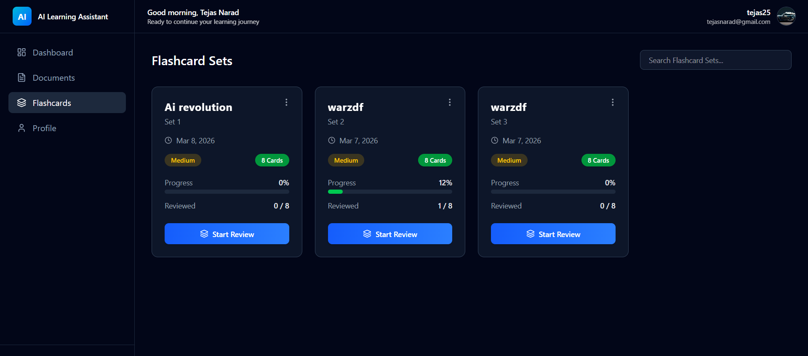
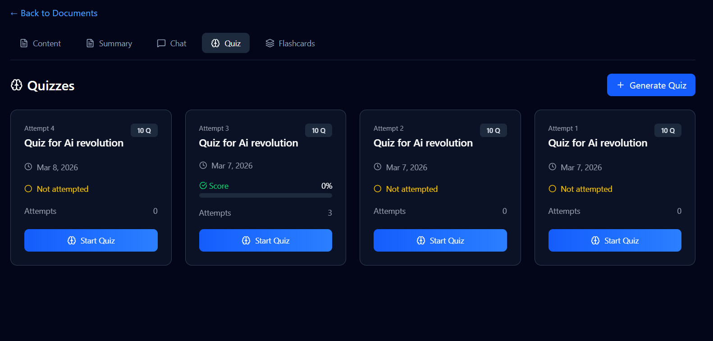
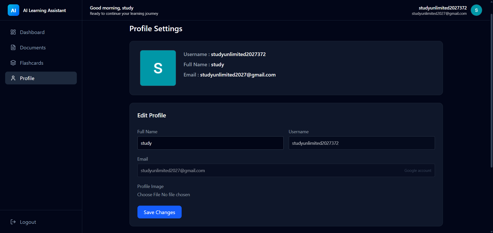

# AI Learning Assistant 🎓

An AI-powered learning platform that transforms your documents into an interactive study experience — generate summaries, flashcards, quizzes, and chat with your content using AI.

## 🌐 Live Demo

**Frontend:** https://ai-eduhelp.vercel.app

---

## ✨ Features

- 📄 **Document Upload** — Upload PDFs and study materials to your personal library
- 🤖 **AI Summarization** — Instantly generate concise summaries of your documents
- 💬 **AI Chatbot** — Chat with your documents and ask questions about your content
- 🃏 **Flashcard Generation** — AI-generated flashcards for quick revision
- 🧠 **Quiz System** — Auto-generated quizzes with detailed performance tracking
- 📊 **Dashboard & Analytics** — Weekly activity charts and quiz score trends
- 👤 **User Authentication** — Email/password login + Google OAuth
- 🖼️ **Profile Management** — Update name, email, and profile photo

---

## 🛠️ Tech Stack

### Frontend
- React + Vite
- React Router DOM
- Tailwind CSS
- Framer Motion
- Recharts
- @react-oauth/google

### Backend
- Node.js + Express.js
- MongoDB + Mongoose
- JWT Authentication (Access + Refresh Tokens)
- HTTP-only Cookies
- Cloudinary (image uploads)
- Google Identity Services

---

## 📁 Project Structure
```
root/
├── client/          # React frontend
│   ├── src/
│   │   ├── pages/
│   │   ├── components/
│   │   ├── context/
│   │   ├── api/
│   │   └── layouts/
│
└── server/          # Express backend
    ├── controllers/
    ├── models/
    ├── routes/
    ├── middlewares/
    └── utils/
```

---

## 🚀 Getting Started Locally

### 1. Clone the repository
```bash
git clone https://github.com/your-username/ai-eduhelp.git
cd ai-eduhelp
```

### 2. Setup Backend
```bash
cd server
npm install
npm run dev
```

### 3. Setup Frontend
```bash
cd client
npm install
npm run dev
```

---

## 🔐 Authentication

- **Local auth** — JWT tokens stored in HTTP-only cookies
- **Google OAuth** — Google Identity Services (GIS) with `idToken` verification
- **Token refresh** — Automatic access token refresh via refresh token
- Protected routes redirect unauthenticated users to the landing page
- Google users cannot change their email address

---

## ☁️ Deployment

### Frontend — Vercel
1. Push code to GitHub
2. Import project on [vercel.com](https://vercel.com)
3. Add your environment variables in Vercel project settings
4. Every push to `main` triggers an automatic redeploy

### Backend — Render
1. Push code to GitHub
2. Create a new **Web Service** on [render.com](https://render.com)
3. Add your environment variables in Render service settings
4. Every push to `main` triggers an automatic redeploy

---

## 📸 Screenshots

### Landing Page


### Dashboard


### Documents


### AI Chatbot


### Flashcards


### Quiz


### Profile


---

## 👨‍💻 Author

**Tejas Narad**
Full Stack Developer | AI Enthusiast

Passionate about building scalable, AI-driven web applications that enhance productivity and learning efficiency.
